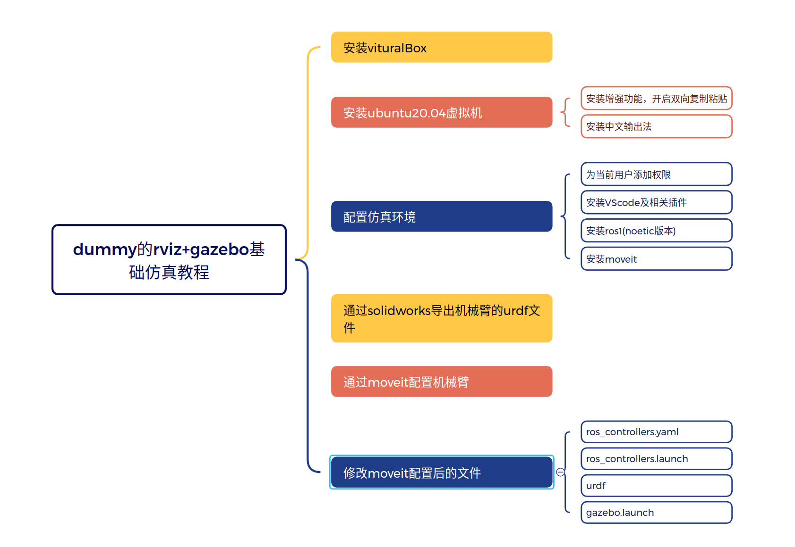
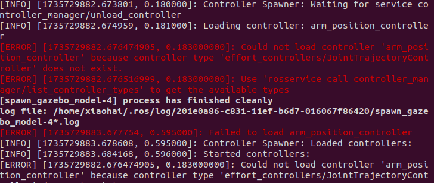
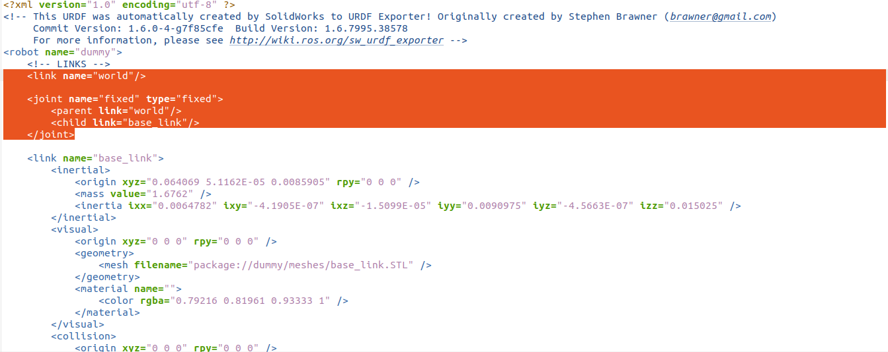
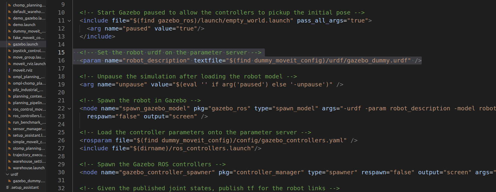

# 注意事项

- 本教程需要大家自己安装VituralBox和ubuntu20.04的虚拟机，以及在虚拟机上安装中文输入法

  

- 若大家不想要自己配置环境，也不想自己修改URDF文件，可以直接下载我配置好的虚拟机，然后在VituralBox直接导入即可，虚拟机网盘链接：

  我用夸克网盘分享了「ubuntu2004.ova」，点击链接即可保存。打开「夸克APP」，无需下载在线播放视频，畅享原画5倍速，支持电视投屏。
  链接：https://pan.quark.cn/s/14a83669c1cf
  提取码：8q2c

- 开源文件链接：

- 分享的文件说明：

  - ws_Dummy文件夹

    

  - backup文件夹

    

  - catkin_ws/src文件夹

    

# gazebo仿真教程

## 安装vituralBox和ubuntu虚拟机

vituralBox和ubuntu20.04安装参考博客：https://blog.csdn.net/Inochigohan/article/details/119791518

切换中文输入法参考博客：https://developer.aliyun.com/article/1244430

## 为当前用户添加权限

```
su root
apt install vim
vim /etc/sudoers
exit
```

## VScode安装

vscode下载网址：https://code.visualstudio.com/Download

## moveit安装

```
moveit_version
sudo apt-get install ros-noetic-moveit
sudo apt install ros-noetic-joint-state-controller
source /opt/ros/noetic/setup.bash
```

## URDF导出

solidworks导出urdf参考：https://www.bilibili.com/video/BV1QKsfegEmy/?spm_id_from=333.337.search-card.all.click&vd_source=b2d2260f634ebe2d5f677833af8bf474

## moveit配置

MoveIt Setup Assistant的配置教程：https://zhuanlan.zhihu.com/p/63172502

## rviz和gazebo的联合仿真控制

参考博客：https://blog.csdn.net/lixushi/article/details/122578852

- 报错解决

  - 首先检查是否安装以下包，若没有安装，则在终端执行下面的命令安装

    

    ```
    sudo apt-get install ros-noetic-joint-trajectory-controller
    sudo apt-get install ros-noetic-joint-state-controller
    sudo apt-get install ros-noetic-effort-controllers
    sudo apt-get install ros-noetic-position-controllers 
    ```

  - 修改配置moveit后生成的文件

    - config/ros_controllers.yaml

      ```
      dummy_position_controller:
        type: effort_controllers/JointTrajectoryController
        joints:
          - joint1
          - joint2
          - joint3
          - joint4
          - joint5
          - joint6
        gains:
          joint1:
            p: 100.0
            i: 0.01
            d: 10.0
          joint2:
            p: 100.0
            i: 0.01
            d: 10.0
          joint3:
            p: 100.0
            i: 0.01
            d: 10.0
          joint4:
            p: 100.0
            i: 0.01
            d: 10.0
          joint5:
            p: 100.0
            i: 0.01
            d: 10.0
          joint6:
            p: 100.0
            i: 0.01
            d: 10.0
      ```
      
    - launch/ros_controllers.launch：修改为上面的控制器名称dummy_position_controller
  
      ```
      <?xml version="1.0"?>
      <launch>
  
        <!-- Load joint controller configurations from YAML file to parameter server -->
      <rosparam file="$(find dummy_moveit_config)/config/ros_controllers.yaml" command="load"/>
      
        <!-- Load the controllers -->
        <node name="controller_spawner" pkg="controller_manager" type="spawner" respawn="false"
          output="screen" args="dummy_position_controller"/>
      
      </launch>
      ```
  
    - 新建urdf文件夹，将moveit生成的urdf复制过来并进行修改，将base_link和世界坐标固定，防止机械臂乱飞的问题，添加下面选中的代码
  
      
  
      ```
      <?xml version="1.0" encoding="utf-8" ?>
      <!-- This URDF was automatically created by SolidWorks to URDF Exporter! Originally created by Stephen Brawner (brawner@gmail.com) 
           Commit Version: 1.6.0-4-g7f85cfe  Build Version: 1.6.7995.38578
           For more information, please see http://wiki.ros.org/sw_urdf_exporter -->
      <robot name="dummy">
      
          <!-- LINKS -->
          <link name="world"/>
      
          <joint name="fixed" type="fixed">
          <parent link="world"/>
              <child link="base_link"/>
          </joint>
      
          <link name="base_link">
              <inertial>
                  <origin xyz="0.064069 5.1162E-05 0.0085905" rpy="0 0 0" />
                  <mass value="0.1" />
                  <inertia ixx="0.3" ixy="0" ixz="0" iyy="0.3" iyz="0" izz="0.3" />
              </inertial>
              <visual>
                  <origin xyz="0 0 0" rpy="0 0 0" />
                  <geometry>
                      <mesh filename="package://dummy/meshes/base_link.STL" />
                  </geometry>
                  <material name="">
                      <color rgba="0.79216 0.81961 0.93333 1" />
                  </material>
              </visual>
              <collision>
                  <origin xyz="0 0 0" rpy="0 0 0" />
                  <geometry>
                      <mesh filename="package://dummy/meshes/base_link.STL" />
                  </geometry>
              </collision>
          </link>
      
          <link name="shoulder_Link">
              <inertial>
                  <origin xyz="0.0058837 0.0056902 0.011066" rpy="0 0 0" />
                  <mass value="0.1" />
                  <inertia ixx="0.1" ixy="0" ixz="0" iyy="0.1" iyz="0" izz="0.1" />
              </inertial>
              <visual>
                  <origin xyz="0 0 0" rpy="0 0 0" />
                  <geometry>
                      <mesh filename="package://dummy/meshes/shoulder_Link.STL" />
                  </geometry>
                  <material name="">
                      <color rgba="0.79216 0.81961 0.93333 1" />
                  </material>
              </visual>
              <collision>
                  <origin xyz="0 0 0" rpy="0 0 0" />
                  <geometry>
                      <mesh filename="package://dummy/meshes/shoulder_Link.STL" />
                  </geometry>
              </collision>
          </link>
          
          <link name="upper_Link">
              <inertial>
                  <origin xyz="0.0020739 -0.070816 -0.0044564" rpy="0 0 0" />
                  <mass value="0.1" />
                  <inertia ixx="0.1" ixy="0" ixz="0" iyy="0.01" iyz="0" izz="0.01" />
              </inertial>
              <visual>
                  <origin xyz="0 0 0" rpy="0 0 0" />
                  <geometry>
                      <mesh filename="package://dummy/meshes/upper_Link.STL" />
                  </geometry>
                  <material name="">
                      <color rgba="0.79216 0.81961 0.93333 1" />
                  </material>
              </visual>
              <collision>
                  <origin xyz="0 0 0" rpy="0 0 0" />
                  <geometry>
                      <mesh filename="package://dummy/meshes/upper_Link.STL" />
                  </geometry>
              </collision>
          </link>
          
          <link name="forearm_Link">
              <inertial>
                  <origin xyz="0.054311 -0.02026 -0.0035789" rpy="0 0 0" />
                  <mass value="0.1" />
                  <inertia ixx="0.01" ixy="0" ixz="0" iyy="0.01" iyz="0" izz="0.01" />
              </inertial>
              <visual>
                  <origin xyz="0 0 0" rpy="0 0 0" />
                  <geometry>
                      <mesh filename="package://dummy/meshes/forearm_Link.STL" />
                  </geometry>
                  <material name="">
                      <color rgba="0.79216 0.81961 0.93333 1" />
                  </material>
              </visual>
              <collision>
                  <origin xyz="0 0 0" rpy="0 0 0" />
                  <geometry>
                      <mesh filename="package://dummy/meshes/forearm_Link.STL" />
                  </geometry>
              </collision>
          </link>
          
          <link name="wrist1_Link">
              <inertial>
                  <origin xyz="-0.00014589 0.0051131 0.060438" rpy="0 0 0" />
                  <mass value="0.1" />
                  <inertia ixx="0.01" ixy="0" ixz="0" iyy="0.01" iyz="0" izz="0" />
              </inertial>
              <visual>
                  <origin xyz="0 0 0" rpy="0 0 0" />
                  <geometry>
                      <mesh filename="package://dummy/meshes/wrist1_Link.STL" />
                  </geometry>
                  <material name="">
                      <color rgba="0.79216 0.81961 0.93333 1" />
                  </material>
              </visual>
              <collision>
                  <origin xyz="0 0 0" rpy="0 0 0" />
                  <geometry>
                      <mesh filename="package://dummy/meshes/wrist1_Link.STL" />
                  </geometry>
              </collision>
          </link>
          
          <link name="wrist2_Link">
              <inertial>
                  <origin xyz="-6.7859E-06 0.039971 0.0050165" rpy="0 0 0" />
                  <mass value="0.1" />
                  <inertia ixx="0" ixy="0" ixz="2.427E-10" iyy="0" iyz="0" izz="0" />
              </inertial>
              <visual>
                  <origin xyz="0 0 0" rpy="0 0 0" />
                  <geometry>
                      <mesh filename="package://dummy/meshes/wrist2_Link.STL" />
                  </geometry>
                  <material name="">
                      <color rgba="0.79216 0.81961 0.93333 1" />
                  </material>
              </visual>
              <collision>
                  <origin xyz="0 0 0" rpy="0 0 0" />
                  <geometry>
                      <mesh filename="package://dummy/meshes/wrist2_Link.STL" />
                  </geometry>
              </collision>
          </link>
          
          <link name="wrist3_Link">
              <inertial>
                  <origin xyz="0.0021192 0.0021217 0.027564" rpy="0 0 0" />
                  <mass value="0.1" />
                  <inertia ixx="0" ixy="0" ixz="0" iyy="0" iyz="0" izz="0" />
              </inertial>
              <visual>
                  <origin xyz="0 0 0" rpy="0 0 0" />
                  <geometry>
                      <mesh filename="package://dummy/meshes/wrist3_Link.STL" />
                  </geometry>
                  <material name="">
                      <color rgba="0.79216 0.81961 0.93333 1" />
                  </material>
              </visual>
              <collision>
                  <origin xyz="0 0 0" rpy="0 0 0" />
                  <geometry>
                      <mesh filename="package://dummy/meshes/wrist3_Link.STL" />
                  </geometry>
              </collision>
          </link>
      
      
      
          <!-- JOINTS -->
          <joint name="joint1" type="revolute">
              <origin xyz="0 0 0.0865" rpy="0 0 0" />
              <parent link="base_link" />
              <child link="shoulder_Link" />
              <axis xyz="0 0 1" />
              <limit lower="-2.97" upper="2.97" effort="30" velocity="3" />
          </joint>
      
          <joint name="joint2" type="revolute">
              <origin xyz="0.035 0 0.0275" rpy="-1.5708 0 0" />
              <parent link="shoulder_Link" />
              <child link="upper_Link" />
              <axis xyz="0 0 1" />
              <limit lower="-1.27" upper="1.57" effort="30" velocity="3" />
          </joint>
      
          <joint name="joint3" type="revolute">
              <origin xyz="0 -0.146 0" rpy="0 0 -1.5708" />
              <parent link="upper_Link" />
              <child link="forearm_Link" />
              <axis xyz="0 0 1" />
              <limit lower="-0.61" upper="1.57" effort="20" velocity="3" />
          </joint>
      
          <joint name="joint4" type="revolute">
              <origin xyz="0.052 0 0" rpy="1.5708 0 3.1416" />
              <parent link="forearm_Link" />
              <child link="wrist1_Link" />
              <axis xyz="0 0 1" />
              <limit lower="-3.14" upper="3.14" effort="10" velocity="3" />
          </joint>
      
          <joint name="joint5" type="revolute">
              <origin xyz="0 0 0.1225" rpy="1.5708 0 0" />
              <parent link="wrist1_Link" />
              <child link="wrist2_Link" />
              <axis xyz="0 0 -1" />
              <limit lower="-2.09" upper="2.09" effort="10" velocity="3" />
          </joint>
      
          <joint name="joint6" type="revolute">
              <origin xyz="0 0.0725 0.0005" rpy="-1.5708 0 0" />
              <parent link="wrist2_Link" />
              <child link="wrist3_Link" />
              <axis xyz="0 0 -1" />
              <limit lower="-12.56" upper="12.56" effort="10" velocity="3" />
          </joint>
      
      
      
          <transmission name="trans_joint1">
              <type>transmission_interface/SimpleTransmission</type>
              <joint name="joint1">
                  <hardwareInterface>hardware_interface/EffortJointInterface</hardwareInterface>
              </joint>
              <actuator name="joint1_motor">
                  <hardwareInterface>hardware_interface/EffortJointInterface</hardwareInterface>
                  <mechanicalReduction>1</mechanicalReduction>
              </actuator>
          </transmission>
          <transmission name="trans_joint2">
              <type>transmission_interface/SimpleTransmission</type>
              <joint name="joint2">
                  <hardwareInterface>hardware_interface/EffortJointInterface</hardwareInterface>
              </joint>
              <actuator name="joint2_motor">
                  <hardwareInterface>hardware_interface/EffortJointInterface</hardwareInterface>
                  <mechanicalReduction>1</mechanicalReduction>
              </actuator>
          </transmission>
          <transmission name="trans_joint3">
              <type>transmission_interface/SimpleTransmission</type>
              <joint name="joint3">
                  <hardwareInterface>hardware_interface/EffortJointInterface</hardwareInterface>
              </joint>
              <actuator name="joint3_motor">
                  <hardwareInterface>hardware_interface/EffortJointInterface</hardwareInterface>
                  <mechanicalReduction>1</mechanicalReduction>
              </actuator>
          </transmission>
          <transmission name="trans_joint4">
              <type>transmission_interface/SimpleTransmission</type>
              <joint name="joint4">
                  <hardwareInterface>hardware_interface/EffortJointInterface</hardwareInterface>
              </joint>
              <actuator name="joint4_motor">
                  <hardwareInterface>hardware_interface/EffortJointInterface</hardwareInterface>
                  <mechanicalReduction>1</mechanicalReduction>
              </actuator>
          </transmission>
          <transmission name="trans_joint5">
              <type>transmission_interface/SimpleTransmission</type>
              <joint name="joint5">
                  <hardwareInterface>hardware_interface/EffortJointInterface</hardwareInterface>
              </joint>
              <actuator name="joint5_motor">
                  <hardwareInterface>hardware_interface/EffortJointInterface</hardwareInterface>
                  <mechanicalReduction>1</mechanicalReduction>
              </actuator>
          </transmission>
          <transmission name="trans_joint6">
              <type>transmission_interface/SimpleTransmission</type>
              <joint name="joint6">
                  <hardwareInterface>hardware_interface/EffortJointInterface</hardwareInterface>
              </joint>
              <actuator name="joint6_motor">
                  <hardwareInterface>hardware_interface/EffortJointInterface</hardwareInterface>
                  <mechanicalReduction>1</mechanicalReduction>
              </actuator>
          </transmission>
          <gazebo>
              <plugin name="gazebo_ros_control" filename="libgazebo_ros_control.so">
                  <robotNamespace>/</robotNamespace>
              </plugin>
          </gazebo>
      </robot>
      
      ```
  
    - 修改launch/gazebo.launch中打开的urdf路径为上面修改后的urdf文件的路径
  
      
  
    - 
  
  - 注意：gazebo加载出来的模型具有**碰撞**属性，如果一个可动的部分与其他物体发生碰撞，那么它就会把它弹开。而发生碰撞，就是说两个**物体重合**了：二者**坐标相近**或者相等，造成**体积有重合**，进而发生碰撞。机械臂的各连杆的质量，转动惯量等物理参数不正确也会导致乱飞。
  
  - 机械臂抖动问题：PID参数问题
